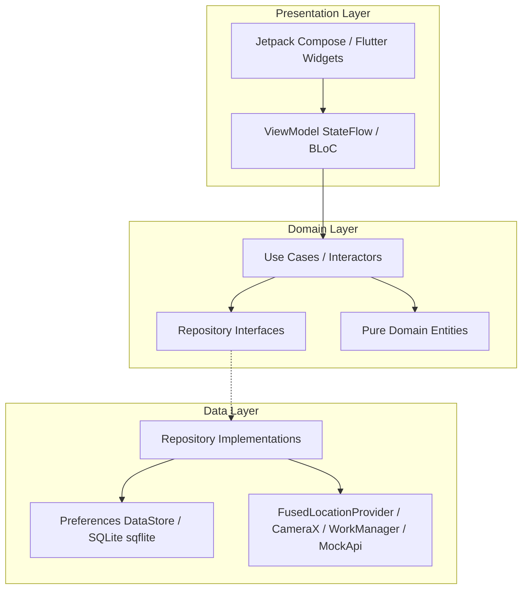

# GeoPulse & AeroSync — Mobile Engineering Technical Assessment

This monorepo delivers two enterprise-grade mobile systems developed for the Senior Mobile Developer Assessment:
1. **Task 1 — GeoPulse (Native Android / Kotlin Jetpack Compose)**: High-accuracy geo-fenced employee attendance system with real-time radial distance tracking, reactive Kotlin Flow location streams, office context calibration, and strict 50-meter geofence validation.
2. **Task 2 — AeroSync (Flutter / Dart)**: Advanced Camera Hardware Integration & Resilient Batch Sync Engine with viewfinder controls, hardware-tailored discrete ratio selection, multi-back lens switching, animated tap-to-focus, offline SQLite queue persistence, and headless WorkManager background synchronization with cross-isolate mutual exclusion locks.

---

## Deliverables & Release APKs

Pre-built binaries are available for direct review:
- **Task 1 (Native Android)**: [Download GeoPulse Release APK](https://github.com/monjur35/Intelligent_machine/releases/latest/download/app-release.apk)
  *(Local build path: `app/build/outputs/apk/debug/app-debug.apk` or `app/build/outputs/apk/release/app-release.apk`)*
- **Task 2 (Flutter App)**: [Download AeroSync Release APK](https://github.com/monjur35/Intelligent_machine/releases/latest/download/aerosync-release.apk)
  *(Local build path: `flutter_camera_sync/build/app/outputs/flutter-apk/app-release.apk`)*

---

## 1. System Architecture & Approaches

Both applications strictly adhere to **Clean Architecture with MVVM (Model-View-ViewModel)** to guarantee decoupled layers, high testability, and zero crashes.

### Architectural Diagram



### Task 1: GeoPulse (Native Android)
- **UI & Presentation**: Built entirely in **Jetpack Compose** with Material 3 tokens.
  - Implements `WindowInsets.statusBars` and `navigationBarsPadding()` for edge-to-edge rendering without status bar overlapping across any screen cutout or aspect ratio.
  - Custom radial arc canvas (`DistanceArcMeter`) providing dynamic color feedback (emerald green within 50m, amber transition, crimson when out-of-range).
  - Cleaned navigation with back arrow removed for dedicated home/kiosk presence.
- **Dependency Injection**: **Dagger Hilt 2.51+** (`@HiltAndroidApp`, `@AndroidEntryPoint`, `@HiltViewModel`).
- **Location Trust & Geofencing**:
  - Enforces `ACCESS_FINE_LOCATION` to guarantee sub-meter accuracy required for a 50m geofence (rejects coarse-only fixes which yield 1–2 km uncertainty on Android 12+).
  - Rejects stale GPS fixes older than 15 seconds and filters out readings with accuracy uncertainty exceeding 30 meters.
  - Pure Kotlin Haversine algorithm fallback for mathematical verification.
- **Persistence & Integrity**:
  - Preferences DataStore for atomic persistence of office coordinates and timestamps.
  - Attendance history persistence tracking timestamps, coordinates, distance, and simulation flags (`isSimulated`).
  - Automatically restores today's check-in status on app startup and guards against duplicate attendance recordings on the same calendar day.
- **Reviewer Simulation Tool**: Integrated segment selector (`Live GPS`, `25m (In)`, `120m (Out)`) gated strictly behind `BuildConfig.DEBUG` so production releases are protected against geofence spoofing.

### Task 2: AeroSync (Flutter)
- **UI & Presentation**: Dark telemetry design aesthetic matching the assessment specification.
  - Interactive viewfinder with pinch-to-zoom and vertical zoom slider.
  - Hardware-tailored discrete ratio selector buttons (`0.5x`, `1.0x`, `2.0x`, `3.0x`/`5.0x`) derived from physical sensor capabilities.
  - Physical back-camera lens selector (`L1`, `L2`, ...) for devices with multiple physical rear lenses.
  - Animated tap-to-focus and exposure reticle (`FocusIndicator`) with easing curves.
  - Shutter button with burst count badge and haptic feedback.
- **Hardware Lifecycle Management**:
  - Implements `RouteAware` and `WidgetsBindingObserver` to release camera hardware when navigating to the Upload Manager or when the app is paused/backgrounded.
  - Eliminates `CAMERA_IN_USE` lockouts, image reader JNI memory leaks, and background battery drain.
- **State Management**: **flutter_bloc ^8.1.6** (`CameraBloc`, `SyncBloc`).
- **Offline Persistence & Queue**: **sqflite** database managing batches, image metadata (`batch_images`), file sizes, retry counters, and statuses (`queued`, `syncing`, `synced`, `failed`).
- **Resilient Sync Engine**:
  - Auto-requeues synced batches when new photos are added, ensuring zero photo loss.
  - Crash recovery: resets stale `syncing` batches to `queued` on startup and in background workers.
  - Cross-isolate mutual exclusion lock (`acquireSyncLock` lease) preventing race conditions between foreground UI uploads and background tasks.
  - Cross-isolate outage simulation: failure simulation toggle is persisted in SQLite, ensuring background workers obey network drop simulations synchronously with the UI.
  - Headless background retries via **WorkManager 0.8.0** with network constraints.
  - Real-time connectivity listening via `connectivity_plus` with automatic queue resumption when internet returns.

---

## 2. Generative AI Tools & Strategic Workflow

### Tools Used
- **Agentic AI**: Google DeepMind Antigravity IDE (Advanced Agentic Pair-Programming Engine).

### Essential Prompts & Outcomes

| # | Prompt Category | Real Prompt Excerpt | Engineer Correction / Manual Refinement |
|---|---|---|---|
| 1 | **Navigation Refactoring** | *"Refactor Flutter main.dart: use a dedicated class or system to manage routes and navigation with centralized routes and clean architecture."* | Created `AppRouter` with `GlobalKey<NavigatorState>`, dynamic route generator, unknown route fallback, and `RouteObserver` for lifecycle tracking. |
| 2 | **Camera Permission Race Guard** | *"Scenario: User enters camera screen for the first time, permission is not yet granted so static UI shows. User accepts prompt; camera should start immediately. Currently it requires navigating away and back. Fix this."* | Diagnosed race condition where permission request completed after controller initialization check. Introduced `_isRequestingPermission` guard and immediate controller start upon permission grant. |
| 3 | **WorkManager Headless Audit** | *"Check the WorkManager implementation against requirements: ensure offline queuing, auto-retry on connection restored, and headless execution."* | Added `WidgetsFlutterBinding.ensureInitialized()` in `callbackDispatcher`, configured exponential backoff, and injected SQLite-backed sync repo. |
| 4 | **Cross-Isolate Mutex & Outage** | *"Background worker ignores the simulated outage because forceFailure lives in UI memory. Batches can also collide if both isolates sync simultaneously. Fix both."* | Architected an `app_config` SQLite table providing cross-isolate persistence for the outage flag and an atomic lease-based mutex lock (`acquireSyncLock`). |
| 5 | **Hardware Lifecycle Management** | *"Camera is never released on inactive or route push, causing ImageReader_JNI spam and battery drain. Implement proper lifecycle release and resume."* | Integrated `RouteAware` with `AppRouter.routeObserver` and `WidgetsBindingObserver`, dispatching `ReleaseCameraEvent` on push/inactive and reinitializing on pop/resume. |
| 6 | **Geofence Trust & Duplicate Guard** | *"Reject coarse-only location on Android 12+, discard stale fixes, restore attendance state on launch, and block duplicate same-day check-ins."* | Restricted `hasLocationPermission` to `ACCESS_FINE_LOCATION`, added 15s freshness filter and 25m accuracy filter, and added `observeAttendanceHistory` in `AttendanceViewModel`. |
| 7 | **Memory & Hardware Leak Audit** | *"Check for memory leaks in both native android and flutter app. If there are any possible memory leaks, prevent it."* | Audited both codebases: (1) Replaced direct Android Context references in `DefaultLocationClient`, `OfficePreferencesDataSource`, and `AttendanceLocalDataSource` with `applicationContext` to eliminate Activity leaks; (2) Added `stopObservingLocation()` on Compose `ON_PAUSE`/`ON_STOP` and `ViewModel.onCleared()` to halt GPS hardware polling in the background; (3) Added `ReleaseCameraEvent` on `CameraPreviewScreen.dispose()`; (4) Replaced unmanaged focus `Future.delayed` timer churn with a cancellable `Timer` in `CameraBloc`; (5) Implemented `dispose()` in `SyncRepositoryImpl` to cleanly close broadcast stream controllers. |

---

## 3. How to Run & Verify

### Prerequisites
- Android Studio Ladybug / Koala or CLI SDK tools
- OpenJDK 17 or 21
- Flutter SDK 3.35.x (`Dart 3.9+`)
- Connected Android Device or Emulator (API 30+)

### Setup Repository
```bash
git clone https://github.com/monjur35/Intelligent_machine.git
cd Intelligent_machine
```

### Task 1: Native Android (GeoPulse)
```bash
# Run unit tests
./gradlew testDebugUnitTest

# Build debug APK
./gradlew assembleDebug

# Install and launch on connected emulator or device
adb install -r app/build/outputs/apk/debug/app-debug.apk
adb shell am start -n com.monjur.employeeattendance/.MainActivity
```

### Task 2: Flutter App (AeroSync)
```bash
# Navigate to Flutter subproject
cd flutter_camera_sync

# Fetch dependencies
flutter pub get

# Verify static analysis (0 warnings, 0 deprecations)
flutter analyze

# Run unit and widget tests
flutter test

# Build release APK
flutter build apk --release

# Run on connected device or emulator
flutter run
```

---

## 4. Visual Verification & Screenshots

### Task 1: GeoPulse (Native Android)

| Location Calibration & Out of Range | In-Range (24m) Geofence Active | Attendance Marked Success |
|:---:|:---:|:---:|
|  |  |  |

### Task 2: AeroSync (Flutter)

| Camera Viewfinder & Controls | Upload Manager Telemetry | Network Outage Retry Resilience | Auto-Resumption Synced |
|:---:|:---:|:---:|:---:|
|  |  |  |  |

---

## 5. Repository Structure

```
EmployeeAttendance/
├── app/                                 # Task 1: Native Android App (Jetpack Compose)
│   ├── src/main/java/com/monjur/employeeattendance/
│   │   ├── di/                          # Dagger Hilt Dependency Injection Modules
│   │   ├── domain/                      # Models, UseCases, Repository Contracts
│   │   ├── data/                        # Preferences DataStore, FusedLocation Client
│   │   └── presentation/                # Jetpack Compose UI, ViewModels, StateFlow
│   └── src/test/                        # Unit tests (UseCases & AttendanceViewModelTest)
│
├── flutter_camera_sync/                 # Task 2: Flutter App (AeroSync)
│   ├── lib/
│   │   ├── core/                        # Themes, AppRouter, NetworkInfo
│   │   ├── domain/                      # Pure Dart Entities, Contracts, UseCases
│   │   ├── data/                        # SQLite DatabaseHelper, Models, Camera & API clients
│   │   ├── presentation/                # BLoC State (CameraBloc, SyncBloc), Viewfinder, Batch Cards
│   │   ├── services/                    # WorkManager Headless Background Worker
│   │   └── main.dart                    # App Entry Point & Dependency Injection
│   └── test/                            # Flutter Unit & Widget Tests
│
├── docs/                                # Technical Specifications & Screenshots
│   ├── PROJECT_PLAN.md                  # Master Engineering Roadmap
│   ├── TASK1_NATIVE_ANDROID_SPEC.md     # Android Architecture & Geofence Spec
│   ├── TASK2_FLUTTER_SYNC_SPEC.md       # Flutter Camera & Resilient Sync Spec
│   └── screenshots/                     # Telemetry & UI Verification Images
│
└── README.md                            # Technical Assessment Master Documentation
```

---

## 6. Known Limitations & Production Hardening Roadmap

While this implementation fulfills all assessment criteria and handles edge cases, production deployment would incorporate:
1. **Room Database for Android History**: Transitioning from delimited DataStore preferences to an Android Room DB with type-safe queries and SQLite migrations.
2. **Camera2 Multi-Camera Physical Lenses**: Leveraging OEM vendor extensions for physical ultra-wide switching on devices where CameraX aggregates lenses behind a single logical camera.
3. **Network Reachability Probe**: Supplementing `connectivity_plus` with an active DNS/HTTP reachability check to detect captive portals before triggering queue uploads.
