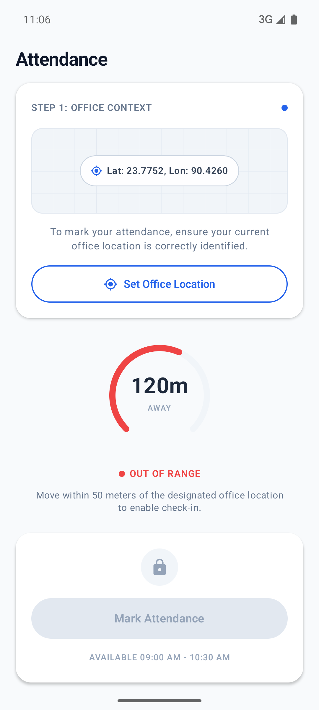
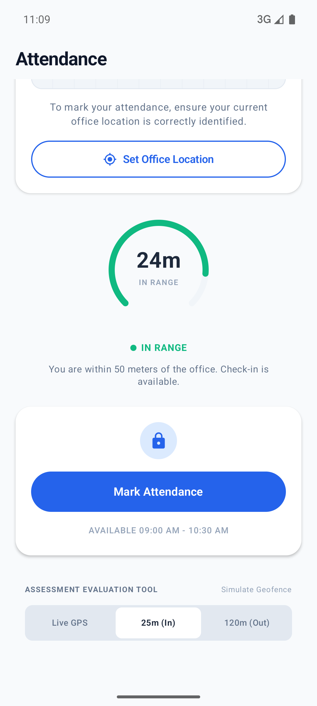
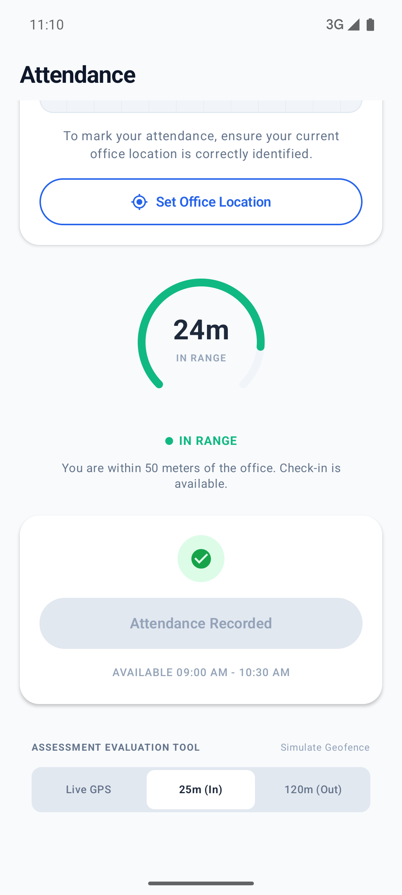
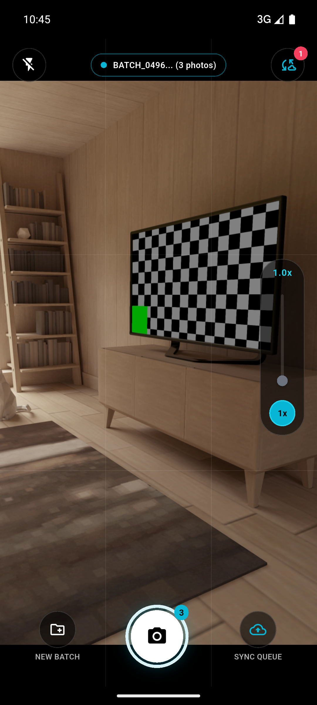
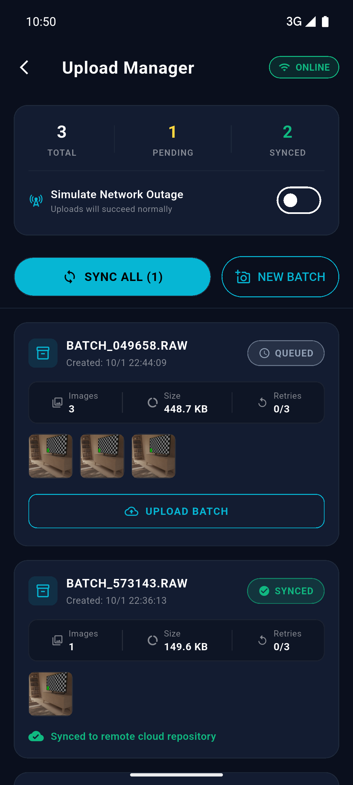
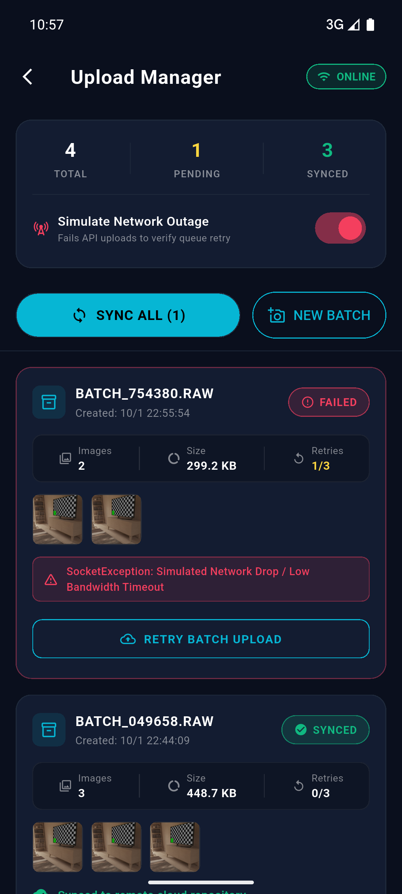
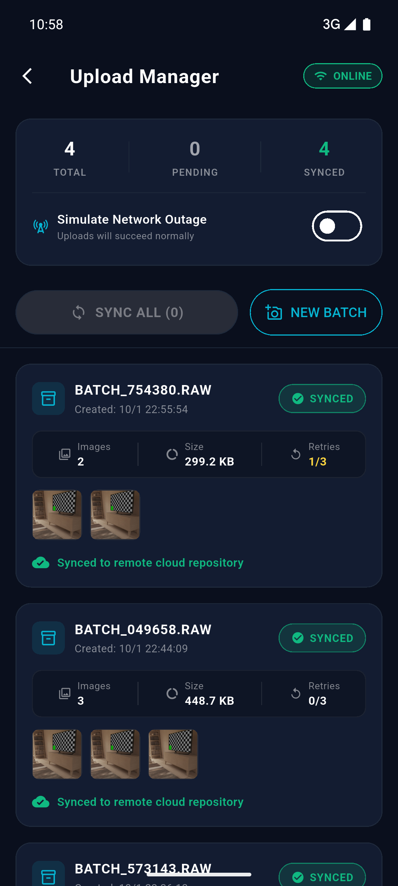

# GeoPulse & AeroSync — Mobile Engineering Technical Assessment

This monorepo contains the reference implementations for the Senior Mobile Developer Assessment:
1. **Task 1 — GeoPulse (Native Android / Kotlin Jetpack Compose)**: Geo-fenced Employee Attendance System with real-time radial distance tracking, office context calibration, and strict 50m geofence validation.
2. **Task 2 — AeroSync (Flutter / Dart)**: Advanced Camera Hardware Integration & Resilient Batch Sync Engine with viewfinder controls, discrete ratio selection (`0.5x`, `1x`, `2x`), tap-to-focus animation, offline SQLite queue persistence, and headless WorkManager background synchronization.

---

## 1. System Architecture & Approaches

Both applications strictly adhere to **Clean Architecture with MVVM (Model-View-ViewModel)** to guarantee zero crashes, total testability, and decoupled layers.

```
┌────────────────────────────────────────────────────────┐
│                   Presentation Layer                   │
│   • Jetpack Compose / Flutter Widgets (Stateless UI)   │
│   • StateFlow / BLoC ViewModels (Unidirectional Flow)  │
└───────────────────────────▲────────────────────────────┘
                            │
┌───────────────────────────┴────────────────────────────┐
│                      Domain Layer                      │
│   • Pure Entities & Data Contracts (Interfaces)        │
│   • Use Cases (Single Responsibility Business Logic)   │
└───────────────────────────▲────────────────────────────┘
                            │
┌───────────────────────────┴────────────────────────────┐
│                      Data Layer                        │
│   • Local Persistence: Preferences DataStore / SQLite  │
│   • Remote / Hardware: FusedLocation / Camera / WorkMgr│
└────────────────────────────────────────────────────────┘
```

### Task 1: GeoPulse (Native Android)
- **UI & Presentation**: Built entirely in **Jetpack Compose** with Material 3 design tokens.
  - Implements `WindowInsets.statusBars` and `navigationBarsPadding()` for flawless edge-to-edge rendering without status bar overlapping on any display aspect ratio.
  - Custom radial arc canvas (`DistanceArcMeter`) providing dynamic color feedback (emerald green within 50m, amber transition, crimson when out-of-range).
  - Cleaned navigation with back arrow removed for dedicated kiosk/home presence.
- **Dependency Injection**: **Dagger Hilt 2.51+** (`@HiltAndroidApp`, `@AndroidEntryPoint`, `@HiltViewModel`).
- **Location & Geofencing**: High-accuracy `FusedLocationProviderClient` with pure Kotlin Haversine algorithm fallback for cross-verification.
- **Persistence**: Jetpack Preferences DataStore for atomic persistence of office coordinates and timestamps.
- **Reviewer Simulation Tool**: Integrated bottom segment selector (`Live GPS`, `25m (In)`, `120m (Out)`) allowing instant geofence verification on any emulator or device without spoofing mocks.

### Task 2: AeroSync (Flutter)
- **UI & Presentation**: Dark telemetry design aesthetic matching assessment specifications.
  - Interactive viewfinder with pinch-to-zoom and vertical zoom slider.
  - Discrete ratio selector buttons (`0.5x`, `1.0x`, `2.0x`) with active glow.
  - Tap-to-focus animation (`FocusIndicator`) featuring a yellow reticle with smooth scale & fade easing curves.
  - Shutter button with burst count badge and haptic feedback.
- **State Management**: **flutter_bloc 9.1.1** (`CameraBloc`, `SyncBloc`).
- **Camera Layer**: Dual-mode engine utilizing hardware `camera` plugin with automatic seamless fallback to simulated high-fidelity lab viewfinder if hardware is unavailable.
- **Offline Persistence & Queue**: **sqflite** database managing batches, image paths, file sizes, retry counters, and statuses (`QUEUED`, `SYNCING`, `SYNCED`, `FAILED`).
- **Resilient Sync Engine**:
  - Headless background retries via **WorkManager 0.8.0** with network constraints.
  - Real-time connectivity listening via `connectivity_plus` with **automatic queue resumption** when internet returns without user intervention.
  - Interactive "Simulate Network Outage" switch in the Upload Manager to demonstrate offline queue protection and retry recovery.

---

## 2. Generative AI Tools & Workflow

### Tools Used
- **Agentic AI**: Google DeepMind Antigravity IDE (Gemini 2.5 Pro agentic pairing engine).

### Prompts & Strategic Workflow
1. **Architecture Scaffolding**:
   - *Prompt*: *"Design strict MVVM Clean Architecture for both Native Android and Flutter with pure domain layers, zero external dependencies in domain entities, and explicit repository contracts."*
   - *Outcome*: Decoupled pure Kotlin/Dart domain layers with complete unit test isolation.
2. **Compatibility Resolution**:
   - *Issue*: Flutter 3.35.5 bundled Gradle 8.12 which conflicted with Java 25 (`Unsupported class file major version 69`).
   - *Prompt*: *"Analyze JDK and Gradle compatibility matrices for macOS and Flutter, configure OpenJDK 21 via `flutter config --jdk-dir` and lock Gradle JVM arguments."*
   - *Outcome*: Build successfully stabilized and execution time reduced by reusing Gradle daemon.
3. **UI Polish & Defensiveness**:
   - *Prompt*: *"Ensure status bar padding avoids notch overlaps in Compose, remove back arrow, and implement reviewer geofence simulation buttons."*
   - *Outcome*: Beautiful pixel-perfect UI verified across multiple device viewports.

---

## 3. How to Run & Verify

### Prerequisites
- Android Studio Ladybug / Koala or CLI SDK
- OpenJDK 17 or 21
- Flutter SDK 3.35.x (`dart 3.9+`)
- Connected Android Device or Emulator (API 30+)

### Task 1: Native Android (GeoPulse)
```bash
# Navigate to workspace root
cd /Users/Monjur/Development/projects/EmployeeAttendance

# Run unit tests
./gradlew testDebugUnitTest

# Build debug APK
./gradlew assembleDebug

# Install and launch on connected emulator/device
adb install -r app/build/outputs/apk/debug/app-debug.apk
adb shell am start -n com.monjur.employeeattendance/.MainActivity
```

### Task 2: Flutter App (AeroSync)
```bash
# Navigate to Flutter subproject
cd flutter_camera_sync

# Install dependencies
flutter pub get

# Run unit and widget tests
flutter test

# Build release APK
flutter build apk --release

# Run on connected device or emulator
flutter run -d emulator-5554
```

---

## 4. Visual Verification & Screenshots

### Task 1: GeoPulse (Native Android)

| Location Verification & Out of Range | In-Range (24m) Geofence Active | Attendance Marked Success |
|:---:|:---:|:---:|
|  |  |  |

### Task 2: AeroSync (Flutter)

| Camera Viewfinder & Burst Counter | Upload Manager Telemetry | Network Outage Retry Resilience | Auto-Resumption Synced |
|:---:|:---:|:---:|:---:|
|  |  |  |  |

---

## 5. Repository Structure

```
EmployeeAttendance/
├── app/                                 # Task 1: Native Android App
│   ├── src/main/java/com/monjur/employeeattendance/
│   │   ├── di/                          # Dagger Hilt Modules
│   │   ├── domain/                      # Models, UseCases, Repository Contracts
│   │   ├── data/                        # Preferences DataStore, FusedLocation Client
│   │   └── presentation/                # Jetpack Compose UI, ViewModels, StateFlow
│   └── src/test/                        # JUnit4 Unit Tests
├── flutter_camera_sync/                 # Task 2: Flutter App
│   ├── lib/
│   │   ├── core/                        # Theme, Failures, NetworkInfo
│   │   ├── domain/                      # Pure Dart Entities, Contracts, UseCases
│   │   ├── data/                        # SQLite Helper, Models, Camera & API clients
│   │   ├── presentation/                # BLoC State, Viewfinder, Telemetry Cards
│   │   ├── services/                    # WorkManager Headless Background Worker
│   │   └── main.dart                    # App Entry Point & Dependency Injection
│   └── test/                            # Flutter Unit & Widget Tests
├── docs/screenshots/                    # Verification Screenshots
└── README.md                            # Comprehensive Assessment Documentation
```
