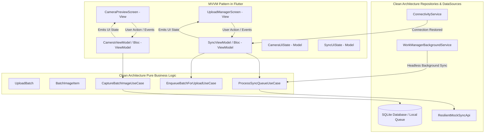

# Task 2 Specification: Advanced Camera & Resilient Sync Engine (Flutter)

## 1. Overview & Requirements
- **Hardware Integration**:
  - `CameraPreviewScreen` with full viewfinder feed.
  - **Zooming**:
    - Smooth pinch-to-zoom gesture detector on preview.
    - Vertical zoom slider on the right side of the screen with haptic response.
    - Discrete rounded zoom pill buttons (`0.5x`, `1x`, `2x` / device lens factors).
  - **Manual Focus**:
    - Tap anywhere on viewfinder to focus & expose at that coordinate.
    - Custom animated focus indicator (pulsing square with corner notches that locks and fades out).
  - **Batch Capturing**:
    - Single tap shutter captures photo and adds to active batch.
    - Shutter button with live count pill (e.g. `BATCH (3)`).
    - Batch thumbnail badge linking to `UploadManagerScreen`.

- **Batch Management & Telemetry UI (`UploadManagerScreen`)**:
  - Matching assessment screenshot styling:
    - Dark futuristic theme with cyan/teal & neon orange accents.
    - Top bar: `Upload Manager`, `SYNC STATUS: RUNNING / IDLE / OFFLINE`.
    - Batch List: `RAW_DATA_NODE_...`, `SATELLITE_SCAN_...`, image count, file size, timestamp, status tags (`QUEUED`, `SYNCING`, `SYNCED`, `FAILED`).
    - Floating / bottom action buttons: `UPLOAD BATCH (12)`, `START NEW UPLOAD BATCH`.

- **Resilient Sync Engine**:
  - **Local Persistence**: Database storing batches and individual image items so no data is lost on app kill or device reboot.
  - **Network Monitoring**: `connectivity_plus` detects connection restoration (`none` -> `wifi` / `cellular`).
  - **Background Worker**: `workmanager` registers periodic and one-off background sync tasks.
  - **Network Resilience & Automatic Retry**:
    - If upload fails due to no internet, server error, or simulated low bandwidth timeout, items remain safe in the local queue with status `QUEUED` or `FAILED`.
    - Once network is restored or worker wakes up, the sync engine **automatically retries** without user intervention.
  - **Mock API Service**:
    - Simulated REST endpoint with configurable success/failure rate and latency.
    - Fully commented real HTTP upload pattern (`http.MultipartRequest` / `dio.FormData`) ready for immediate backend integration.

---

## 2. Architecture & Data Flow (MVVM with Clean Architecture)

---

## 3. MVVM Contracts (BLoC / Cubit ViewModels & UI States)

### Camera ViewModel (`CameraBloc`)
- **User Actions / Events**:
  - `InitializeCamera`
  - `UpdateZoomLevel(double zoom)`
  - `SetZoomRatio(double ratio)`
  - `TapToFocus(Offset point)`
  - `CapturePhoto`
  - `CreateNewBatch`
  - `SwitchCamera`
- **Exposed UI State (Model)**:
  - `CameraUiState`: `initial`, `loading`, `ready(zoomLevel, minZoom, maxZoom, focusPoint, activeBatch, flashMode)`, `error(message)`

### Sync ViewModel (`SyncBloc`)
- **User Actions / Events**:
  - `LoadBatches`
  - `QueueBatchForUpload(String batchId)`
  - `TriggerSyncAll`
  - `NetworkConnectivityChanged(ConnectivityResult status)`
  - `BackgroundWorkerTriggered`
  - `SimulateNetworkFailure(bool forceFail)`
- **Exposed UI State (Model)**:
  - `SyncUiState`: `initial`, `loading`, `loaded(batches, isOnline, syncProgress, syncStatus: IDLE | RUNNING | RETRYING)`

---

## 4. WorkManager & Background Sync Strategy
- Registers a periodic background task with `NetworkType.connected` constraint.
- When triggered, instantiates the repository in headless Dart isolate, loads queued batches, uploads sequentially, and updates SQLite status.
- UI listens to stream / updates immediately when reopened or in foreground.
